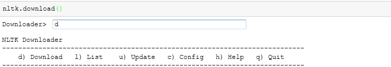
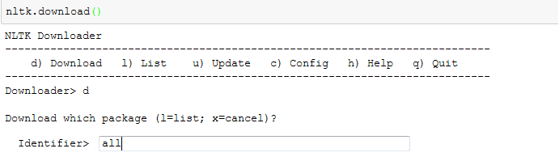
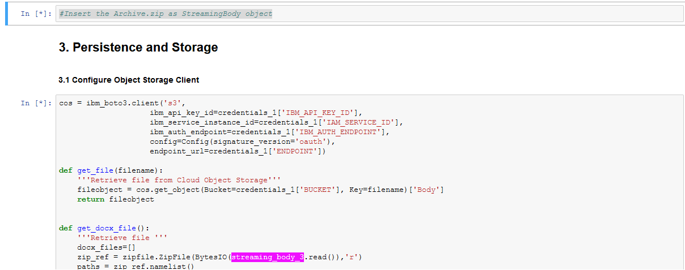

Troubleshooting
===============

Jupyter Notebooks
-----------------

* Make sure the pip install ran correctly. You might need to restart the
  kernel and run the cells from the top after the pip install runs the first
  time.
* Many of the cells rely on variables that are set in earlier cells. Some of
  these are cleared in later cells. Start over at the top when troubleshooting.
* Many of the cells rely on service credentials from IBM Cloud that are set in
  earlier cells. Make sure to add your service credentials correctly.

Package not found errors
------------------------

You might encounter this nltk error, `package not found`. To avoid that please follow the steps given below:

1. run nltk.download() :
2. Type `d` and press enter

   

3. Type `all` and press enter

   

If you encouter a streaming body object:

Make sure the StreamingBody object variable in cell 2.2 is mentioned in the highlighted space.

