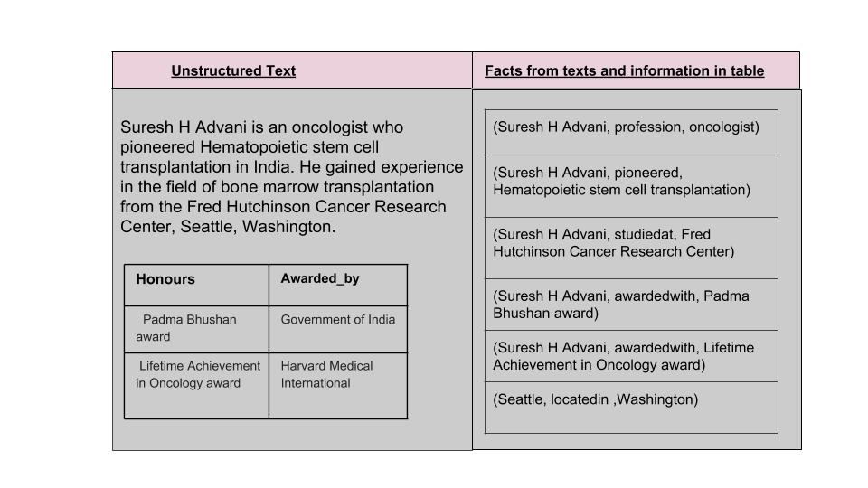

# Build-knowledge-base-with-domain-specific-documents
> Data Science Experience is now Watson Studio. Although some images in this code pattern may show the service as Data Science Experience, the steps and processes will still work.

**[BK] Since this pattern is not published, please see if you can give Watson Studio specific instructions**

**[BK] To start with give a background of the problem. Take the example of the data you took for the pattern to explain it better.**

Raw Text have lots of useful information which can give interesting insights about the domain or a person or a department. The best and not so best part of it is its flooded everywhere. Our brain can process raw text easily, reads it quickly word by word and makes sense out of it. How do we make machines read that raw text and train it on the context. The analysis of the unstructured Data starts with a conventional process to somehow convert it into a semi-structured format, which is much easier to perform the analysis on. 

In this Code pattern, we are trying to address two major problems one can come across while processing the raw text(unstructured data). In the image above, there is a free-floating text about an oncologist Suresh H. Advani and the table consists of the awards, he has been awarded by various organisations. And also the facts that can be inferred about various entities in this document. The pattern provides a methodology to build a knowledge graph from the information extracted.The Code Pattern covers and addresses all the aspects to it, right from the challenges that one can come across while building the knowledge graph and how to resolve them,  how to fine tuning this code pattern to meet their requirements. 

One of the challenge to process unstructured documents like the image above is how do we process the information stored in the tables of a document as well along with free-floating text. Then, finally construct the domain specific knowledge base from the mined information. So to process the information stored in the tables as well as free floating text, this pattern makes use of the `python package mammoth` to convert docx files(unsturctured) to html(semi-sturctured format) and then analyzing it further using [Watson NLU Demo](https://natural-language-understanding-demo.ng.bluemix.net/). 

Another challenge this Code Pattern addresses is, there are lots of keywords in the text are not picked up as an entity by Watson NLU. This is because Watson NLU has been trained on a default corpus of documents. For the same reason, mining information from set of domain-specific documents is very challenging task to do using just Watson NLU. This pattern discusses the strategy on how to augment the results given by Watson NLU with the rules-based approach to pick entities of that domain and their relations with each other. This Code Pattern makes use of the [Extend Watson text Classification](https://developer.ibm.com/code/patterns/extend-watson-text-classification/) Code Pattern to augment the entities picked by nlu, and [Watson Document Corelation](https://developer.ibm.com/code/patterns/watson-document-correlation/) from different sources to augment the relations picked by NLU. One just have to configure the configuration files and they get the benefits of both the worlds. 

In this Pattern we will demonstrate:

* Extracting the information from the documents- free-floating text and Table text.
* Cleaning the data](https://developer.ibm.com/code/patterns/extend-watson-text-classification/) pattern to extract entities from documents
* Use [Watson Document Corelation](https://developer.ibm.com/codetterns/watson-document-correlation/) pattern to extract relationships between entities*
* Build a knowledge base(graph) from it.

What make the Code Pattern valuable is its ability to process the tables in docx files along free-floating text and then showcasing the entire strategy on how to make use of both the results of the real-time analysis by Watson NLU and rules defined by a Subject matter expert or Domain expert.

This Code Pattern is intended to help Developers, Data Scientists to give structure to the unstructured data. Using which they can shape their analysis significantly such that communicating with data will be much easier for further processing and can yield better Insights. 

1. The unstructured text data from the docx files(html tables and free floating text) that need to be analyzed and correlated is extracted from the documents using python code.
2. Use Extend Watson text Classification text is classified using Watson NLU and also tagged using the code pattern - [Extend Watson text classification](https://github.com/IBM/watson-document-classifier)
3. The text is correlated with other text using the code pattern - [Correlate documents](https://github.com/IBM/watson-document-co-relation)  
4. The results are filtered using python code.
5. The knowledge graph is constructed.

## Included components

* [IBM Watson Studio](https://www.ibm.com/cloud/watson-studio): Analyze data using RStudio, Jupyter, and Python in a configured, collaborative environment that includes IBM value-adds, such as managed Spark.

* [IBM Cloud Object Storage](https://console.bluemix.net/catalog/infrastructure/cloud-object-storage): An IBM Cloud service that provides an unstructured cloud data store to build and deliver cost effective apps and services with high reliability and fast speed to market.

* [Watson Natural Language Understanding](https://console.bluemix.net/catalog/services/natural-language-understanding/?cm_sp=dw-bluemix-_-code-_-devcenter): A IBM Cloud service that can analyze text to extract meta-data from content such as concepts, entities, keywords, categories, sentiment, emotion, relations, semantic roles, using natural language understanding.

## Featured technologies

* [Jupyter Notebooks](http://jupyter.org/): An open-source web application that allows you to create and share documents that contain live code, equations, visualizations and explanatory text.

# Steps

Follow these steps to setup and run this code pattern. The steps are
described in detail below.

1. [Sign up for Watson Studio](#1-sign-up-for-watson-studio)
1. [Create IBM Cloud services](#2-create-ibm-cloud-services)
1. [Create the notebook](#3-create-the-notebook)
1. [Add the data and configuraton file](#4-add-the-data-and-configuration-file)
1. [Update the notebook with service credentials](#5-update-the-notebook-with-service-credentials)
1. [Run the notebook](#6-run-the-notebook)
1. [Analyze the results](#7-analyze-the-results)

## 1. Sign up for Watson Studio

Sign up for IBM's [Watson Studio](https://dataplatform.ibm.com). By creating a project in Watson Studio a free tier ``Object Storage`` service will be created in your IBM Cloud account. Take note of your service names as you will need to select them in the following steps.

> Note: When creating your Object Storage service, select the ``Free`` storage type in order to avoid having to pay an upgrade fee.

## 2. Create IBM Cloud services

Create the following IBM Cloud service and name it wdc-NLU-service:

  * [**Watson Natural Language Understanding**](https://console.bluemix.net/catalog/services/natural-language-understanding)

  

## 3. Create the notebook

* In [Watson Studio](https://dataplatform.ibm.com), click on `Create notebook` to create a notebook.
* Create a project if necessary, provisioning an object storage service if required.
* In the `Assets` tab, select the `Create notebook` option.
* Select the `From URL` tab.
* Enter a name for the notebook.
* Optionally, enter a description for the notebook.
* Enter this Notebook URL: https://github.com/IBM/build-knowledge-base-with-domain-specific-documents/blob/master/notebook/Knowledge_graph.ipynb
* Select the free Anaconda runtime.
* Click the `Create` button.

## 4. Add the data and configuration file

#### Add the data and configuration to the notebook

* From the `My Projects > Default` page, Use `Find and Add Data` (look for the `10/01` icon)
and its `Files` tab.
* Click `browse` and navigate to [Archive.zip](https://github.com/IBM/build-knowledge-base-with-domain-specific-documents/tree/master/Data)
* Click `browse` and navigate to [config_relations.txt](https://github.com/IBM/build-knowledge-base-with-domain-specific-documents/tree/master/Configuration)
* Click `browse` and navigate to [config_classification.txt](https://github.com/IBM/build-knowledge-base-with-domain-specific-documents/tree/master/Configuration)

> Note:  It is possible to use your own data and configuration files.
If you use a configuration file from your computer, make sure to conform to the JSON structure given in `Configuration/config_classification.txt`.

## 5. Update the notebook with service credentials

#### Add the Watson Natural Language Understanding credentials to the notebook
Select the cell below `2.1 Add your service credentials from IBM Cloud for the Watson services` section in the notebook to update the credentials for Watson Natural Langauage Understanding. 

Open the Watson Natural Language Understanding service in your [IBM Cloud Dashboard](https://console.bluemix.net/dashboard/services) and click on your service, which you should have named `wdc-NLU-service`.

Once the service is open click the `Service Credentials` menu on the left.

In the `Service Credentials` that opens up in the UI, select whichever `Credentials` you would like to use in the notebook from the `KEY NAME` column. Click `View credentials` and copy `username` and `password` key values that appear on the UI in JSON format.

Update the `username` and `password` key values in the cell below `2.1 Add your service credentials from IBM Cloud for the Watson services` section.

#### Add the Object Storage credentials to the notebook
* Select the cell below `2.2 Add your service credentials for Object Storage` section in the notebook to update the credentials for Object Store.
* Delete the contents of the cell

* Use `Find and Add Data` (look for the `10/01` icon) and its `Files` tab. You should see the file names uploaded earlier. Make sure your active cell is the empty one below `2.2 Add...`
* Select `Insert to code` (below your sample_text.txt).
* Click `Insert Credentials` from drop down menu.
* Make sure the credentials are saved as `credentials_1`.

## 6. Run the notebook

When a notebook is executed, what is actually happening is that each code cell in
the notebook is executed, in order, from top to bottom.

> IMPORTANT: The first time you run your notebook, you will need to install the necessary
packages in section 1.1 and then `Restart the kernel`.

Each code cell is selectable and is preceded by a tag in the left margin. The tag
format is `In [x]:`. Depending on the state of the notebook, the `x` can be:

* A blank, this indicates that the cell has never been executed.
* A number, this number represents the relative order this code step was executed.
* A `*`, this indicates that the cell is currently executing.

There are several ways to execute the code cells in your notebook:

* One cell at a time.
  * Select the cell, and then press the `Play` button in the toolbar.
* Batch mode, in sequential order.
  * From the `Cell` menu bar, there are several options available. For example, you
    can `Run All` cells in your notebook, or you can `Run All Below`, that will
    start executing from the first cell under the currently selected cell, and then
    continue executing all cells that follow.
* At a scheduled time.
  * Press the `Schedule` button located in the top right section of your notebook
    panel. Here you can schedule your notebook to be executed once at some future
    time, or repeatedly at your specified interval.

## 7. Analyze the results
In the Section. Process of the notebook, the files are loaded. First the configuration files(config_classification.txt and config_relations.txt) are loaded. The unstructured information is extracted using python package mammoth. Mammoth converts the docx files to html from where text in the tables is also analysed along with free floating text. The results from Watson NLU are analyzed and augmented using the configuration files. The entities are augmented using the `config_classification.txt` and the relationships are augmented using `config_relations.txt`. The results are then filtered and formatted to pick up the relevant relations and discard the ones which are not relevant. The filtered relaionships are sent to draw graph function in the notebook, which will construct the knowledge graph.

# Troubleshooting

[See DEBUGGING.md.](DEBUGGING.md)

# License

[Apache 2.0](LICENSE)
