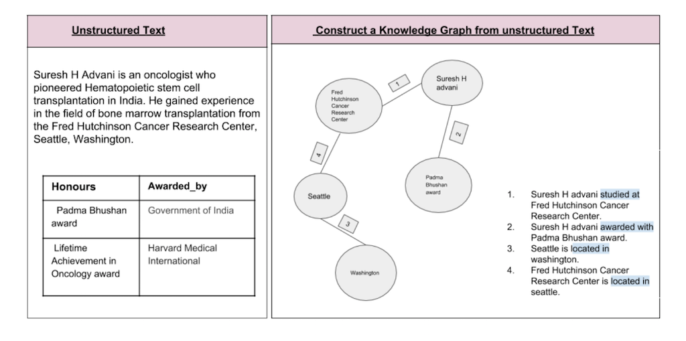

# Build-knowledge-base-with-domain-specific-documents
> Data Science Experience is now Watson Studio. Although some images in this code pattern may show the service as Data Science Experience, the steps and processes will still work.

In any business, word documents are a common occurence. They contain information in the form of raw text, tables and images. All of them contain important facts. The data used in this code pattern comes from two Wikipedia articles. The first is taken from the Wikipedia page of oncologist [Suresh H. Advani](https://en.wikipedia.org/wiki/Suresh_H._Advani) the second is from the Wikipedia page about [Oncology](https://en.wikipedia.org/wiki/Oncology). These files are zipped up as [Archive.zip](data/Archive.zip).

In the figure below, there is a textual information about an oncologist Suresh H. Advani present in a word document. The table consists of the awards that he has been awarded by various organisations. 

 
In this Code pattern, we address the problem of extracting knowledge out of **text and tables** in word documents. A knowledge graph is built from the knowledge extracted making the knowledge queryable.

Some of the challenges in extracting knowledge from word documents are:
1. The Natural Language Processing (NLP) tools cannot access the text inside word documents. The word documents need to be converted to plain text files.
2. There are business and domain experts who understand the keywords and entities that are present in the documents. But training the NLP tool to extract domain specific keywords and entities is a big effort. Also, it is impractical in many scenarios to find sufficient number of documents to train the NLP tool to process the text. 

This pattern uses the below methodology to overcome the challenges:
* The [`python package mammoth`](https://pypi.org/project/mammoth/) is used to convert `.docx` files to html (semi-structured format). 
* Watson Natural Language Understanding (Watson NLU) is used to extract the common entities
* A rules based approach that is explained in the code pattern [Extend Watson text Classification](https://developer.ibm.com/code/patterns/extend-watson-text-classification/) is used to augment the output from Watson NLU. The rules based approach does not require training documents or training effort. A configuration file is taken as input by the algorithm. This file needs to be configured by the domain expert.
* Watson NLU is used to extract the relations between entities
* A rules based approach that is explained in the code pattern [Watson Document Corelation](https://developer.ibm.com/code/patterns/watson-document-correlation/) is used to augment the output from Watson NLU. A configuration file is taken as input by the algorithm. This file needs to be configured by the domain expert.

The best of both worlds - training and rules based approach is used to extract knowledge out of documents.

In this Pattern we will demonstrate:

* Extracting the information from the documents- free-floating text and Table text.
* [Cleaning the data](https://developer.ibm.com/code/patterns/extend-watson-text-classification/) pattern to extract entities from documents
* Use [Watson Document Corelation](https://developer.ibm.com/codetterns/watson-document-correlation/) pattern to extract relationships between entities*
* Build a knowledge base(graph) from it.

What makes this Code Pattern valuable:
* The ability to process the tables in docx files along with free-floating text. 
* And also the strategy on combining the results of the real-time analysis by Watson NLU and the results from the rules defined by a Subject matter expert or Domain expert.

This Code Pattern is intended to help Developers, Data Scientists to give structure to the unstructured data. This can be used to shape their analysis significantly and use the data for further processing to get better Insights. 

 

1. The unstructured text data from the docx files(html tables and free floating text) that need to be analyzed and correlated is extracted from the documents using python code.
2. Use Extend Watson text Classification text is classified using Watson NLU and also tagged using the code pattern - [Extend Watson text classification](https://github.com/IBM/watson-document-classifier)
3. The text is correlated with other text using the code pattern - [Correlate documents](https://github.com/IBM/watson-document-co-relation)  
4. The results are filtered using python code.
5. The knowledge graph is constructed.

## Video

## Included components

* [IBM Watson Studio](https://www.ibm.com/cloud/watson-studio): Analyze data using RStudio, Jupyter, and Python in a configured, collaborative environment that includes IBM value-adds, such as managed Spark.

* [IBM Cloud Object Storage](https://console.bluemix.net/catalog/infrastructure/cloud-object-storage): An IBM Cloud service that provides an unstructured cloud data store to build and deliver cost effective apps and services with high reliability and fast speed to market.

* [Watson Natural Language Understanding](https://console.bluemix.net/catalog/services/natural-language-understanding/?cm_sp=dw-bluemix-_-code-_-devcenter): A IBM Cloud service that can analyze text to extract meta-data from content such as concepts, entities, keywords, categories, sentiment, emotion, relations, semantic roles, using natural language understanding.

## Featured technologies

* [Jupyter Notebooks](http://jupyter.org/): An open-source web application that allows you to create and share documents that contain live code, equations, visualizations and explanatory text.

# Steps

Follow these steps to setup and run this code pattern. The steps are
described in detail below.

1. [Create IBM Cloud services](#1-create-ibm-cloud-services)
1. [Run using a Jupyter notebook in the IBM Watson Studio](#2-run-using-a-jupyter-notebook-in-the-ibm-watson-studio)
1. [Analyze the results](#3-analyze-the-results)

## 1. Create IBM Cloud services

Create the following IBM Cloud service and name it wdc-NLU-service:

  * [**Watson Natural Language Understanding**](https://console.bluemix.net/catalog/services/natural-language-understanding)

  

## 2. Run using a Jupyter notebook in the IBM Watson Studio

1. [Create a new Watson Studio project](#21-create-a-new-watson-studio-project)
2. [Create the notebook](#22-create-the-notebook)
3. [Run the notebook](#23-run-the-notebook)
4. [Upload data](#24-upload-data)
5. [Save and Share](#25-save-and-share)

### 2.1 Create a new Watson Studio project

* Log in or sign up for IBM's [Watson Studio](https://dataplatform.ibm.com).

* Select the `New Project` option from the Watson Studio landing page and choose the `Jupyter Notebooks` option.

* To create a project in Watson Studio, give the project a name and either create a new `Cloud Object Storage` service or select an existing one from your IBM Cloud account.

* Upon a successful project creation, you are taken to a dashboard view of your project. Take note of the `Assets` and `Settings` tabs, we'll be using them to associate our project with any external assets (datasets and notebooks) and any IBM cloud services.

### 2.2 Create the notebook

* From the project dashboard view, click the `Assets` tab, click the `+ New notebook` button.

* Give your notebook a name and select your desired runtime, in this case we'll be using the associated Spark runtime.

* Now select the `From URL` tab to specify the URL to the notebook in this repository.

* Click the `Create` button.

### 2.3 Run the notebook

When a notebook is executed, what is actually happening is that each code cell in
the notebook is executed, in order, from top to bottom.

Each code cell is selectable and is preceded by a tag in the left margin. The tag
format is `In [x]:`. Depending on the state of the notebook, the `x` can be:

* A blank, this indicates that the cell has never been executed.
* A number, this number represents the relative order this code step was executed.
* A `*`, this indicates that the cell is currently executing.

There are several ways to execute the code cells in your notebook:

* One cell at a time.
  * Select the cell, and then press the `Play` button in the toolbar.
* Batch mode, in sequential order.
  * From the `Cell` menu bar, there are several options available. For example, you
    can `Run All` cells in your notebook, or you can `Run All Below`, that will
    start executing from the first cell under the currently selected cell, and then
    continue executing all cells that follow.
* At a scheduled time.
  * Press the `Schedule` button located in the top right section of your notebook
    panel. Here you can schedule your notebook to be executed once at some future
    time, or repeatedly at your specified interval.

### 2.4 Upload data

#### Upload the data and configuration to the notebook

* From the `My Projects > Default` page, Use `Find and Add Data` (look for the `10/01` icon)
and its `Files` tab.
* Click `browse` and navigate to [Archive.zip](https://github.com/IBM/build-knowledge-base-with-domain-specific-documents/tree/master/data)
* Click `browse` and navigate to [config_relations.txt](https://github.com/IBM/build-knowledge-base-with-domain-specific-documents/tree/master/data)
* Click `browse` and navigate to [config_classification.txt](https://github.com/IBM/build-knowledge-base-with-domain-specific-documents/tree/master/data)

> Note:  It is possible to use your own data and configuration files.
If you use a configuration file from your computer, make sure to conform to the JSON structure given in `data/config_classification.txt`.

### 2.5 Save and Share

#### How to save your work:

Under the `File` menu, there are several ways to save your notebook:

* `Save` will simply save the current state of your notebook, without any version
  information.
* `Save Version` will save your current state of your notebook with a version tag
  that contains a date and time stamp. Up to 10 versions of your notebook can be
  saved, each one retrievable by selecting the `Revert To Version` menu item.

#### How to share your work:

You can share your notebook by selecting the “Share” button located in the top
right section of your notebook panel. The end result of this action will be a URL
link that will display a “read-only” version of your notebook. You have several
options to specify exactly what you want shared from your notebook:

* `Only text and output`: will remove all code cells from the notebook view.
* `All content excluding sensitive code cells`:  will remove any code cells
  that contain a *sensitive* tag. For example, `# @hidden_cell` is used to protect
  your dashDB credentials from being shared.
* `All content, including code`: displays the notebook as is.
* A variety of `download as` options are also available in the menu.

## 3. Analyze the results
In the Section. Process of the notebook, the files are loaded. First the configuration files(config_classification.txt and config_relations.txt) are loaded. The unstructured information is extracted using python package mammoth. Mammoth converts the docx files to html from where text in the tables is also analysed along with free floating text. The results from Watson NLU are analyzed and augmented using the configuration files. The entities are augmented using the `config_classification.txt` and the relationships are augmented using `config_relations.txt`. The results are then filtered and formatted to pick up the relevant relations and discard the ones which are not relevant. The filtered relaionships are sent to draw graph function in the notebook, which will construct the knowledge graph.

# Learn more

* **Data Analytics Code Patterns**: Enjoyed this Code Pattern? Check out our other [Data Analytics Code Patterns](https://developer.ibm.com/code/technologies/data-science/)
* **AI and Data Code Pattern Playlist**: Bookmark our [playlist](https://www.youtube.com/playlist?list=PLzUbsvIyrNfknNewObx5N7uGZ5FKH0Fde) with all of our Code Pattern videos
* **Watson Studio**: Master the art of data science with IBM's [Watson Studio](https://dataplatform.ibm.com/)
* **Spark on IBM Cloud**: Need a Spark cluster? Create up to 30 Spark executors on IBM Cloud with our [Spark service](https://console.bluemix.net/catalog/services/apache-spark)

# Troubleshooting

[See DEBUGGING.md.](DEBUGGING.md)

# License

[Apache 2.0](LICENSE)
